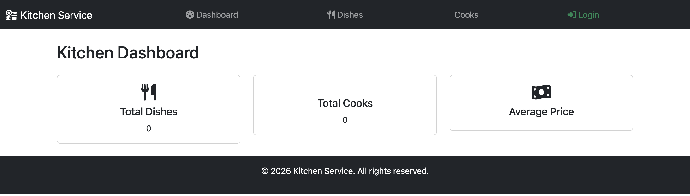

# Restaurant Kitchen Service
> Django-based web application for managing restaurant kitchen workflow

## Check it out!
[Restaurant Kitchen Service deployed to Render](https://example.com)

A web app to organize and manage restaurant kitchen tasks.  
Includes dashboard, dishes management, and cooks management.

## Demo


## Installing / Getting started

Clone the repository and set up the environment:

```shell
git clone https://github.com/ihor-seven/restaurant-kitchen-service.git
cd restaurant-kitchen-service
python3 -m venv venv
source venv/bin/activate
pip install -r requirements.txt
python manage.py migrate
python manage.py runserver